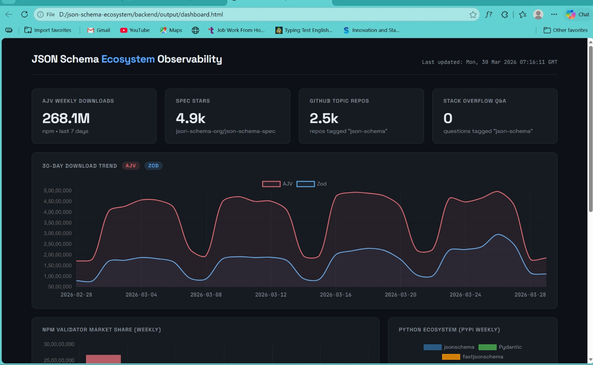
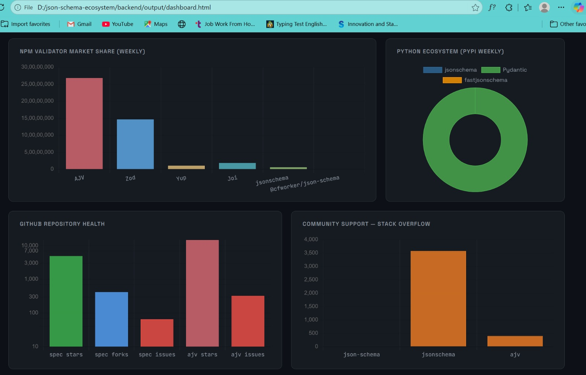
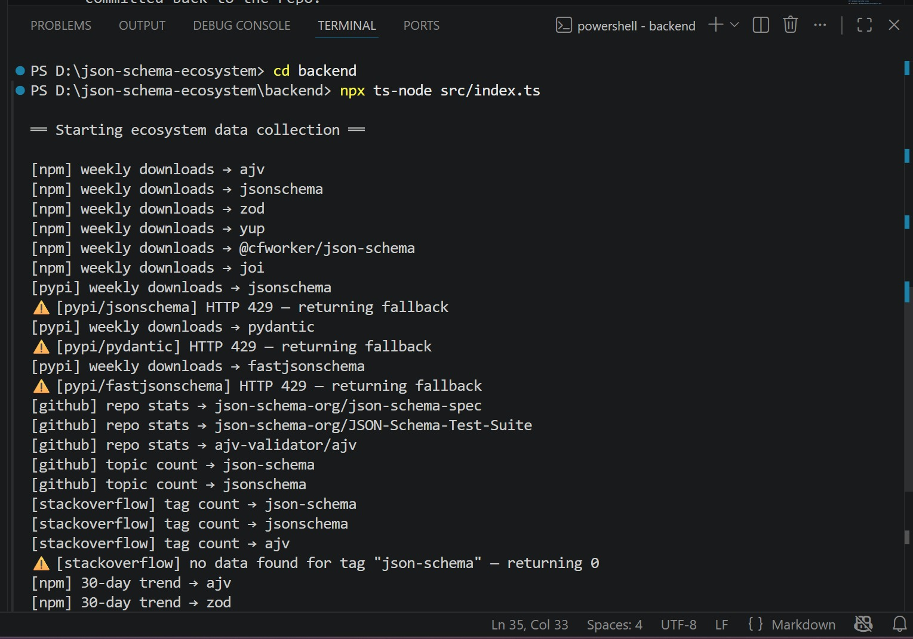
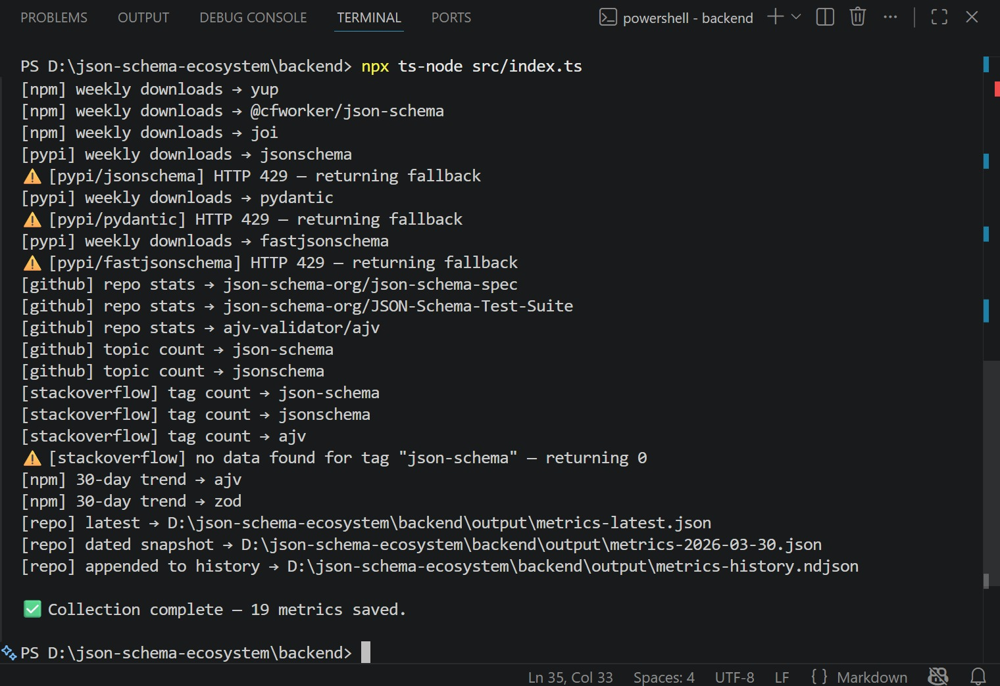

# JSON Schema Ecosystem Observability

> GSoC 2026 qualification task submission for [json-schema-org/community#980](https://github.com/json-schema-org/community/issues/980)

Automated, daily collection of metrics across the JSON Schema ecosystem — covering validators, community health, cross-language adoption, and historical trends.

---

## ✅ What this does

| Category | Metrics |
|---|---|
| **npm validator market share** | AJV, Zod, Yup, Joi, jsonschema, @cfworker/json-schema — weekly downloads |
| **Python ecosystem** | jsonschema, Pydantic, fastjsonschema — weekly PyPI downloads |
| **GitHub health** | Stars, forks, open issues for `json-schema-spec`, `JSON-Schema-Test-Suite`, `ajv` |
| **Community** | GitHub repos tagged `json-schema`, Stack Overflow questions for `json-schema` / `ajv` |
| **Historical trend** | 30-day daily download trend for AJV and Zod (shows ecosystem evolution) |

All metrics are collected automatically every day via **GitHub Actions** and committed back to the repo.

---

## 📊 Dashboard

After running the collector, open `backend/output/dashboard.html` in a browser.

Charts included:
- 30-day download trend (AJV vs Zod)
- npm validator market share (bar)
- Python ecosystem (doughnut)
- GitHub health (log-scale bar)
- Stack Overflow questions (bar)

**Live Generated Dashboard:**


---

## 🗄️ Output files

| File | Purpose |
|---|---|
| `output/metrics-latest.json` | Most recent snapshot (overwritten each run) |
| `output/metrics-YYYY-MM-DD.json` | Dated snapshot for every run |
| `output/metrics-history.ndjson` | Append-only log — one JSON object per line — for long-term trend analysis |
| `output/dashboard.html` | Generated HTML dashboard |

The NDJSON history file means you can reconstruct trends over any time range without an external database.

---

## 🚀 Running locally

```bash
cd backend
npm install

# Set optional GitHub token to avoid rate limits (60 req/hr unauthenticated)
export GITHUB_TOKEN=ghp_your_token_here

# Collect metrics
npx ts-node src/index.ts

# Generate dashboard
npx ts-node src/services/generateDashboard.ts

# Open dashboard
open output/dashboard.html

```
**Pipeline Execution & Graceful Degradation in Action:**



---

## ⚙️ Automated via GitHub Actions

The workflow at `.github/workflows/collect-metrics.yml`:
- Runs **daily at 06:00 UTC**
- Can also be triggered manually from the GitHub UI
- Uses `GITHUB_TOKEN` (auto-provided by Actions) for authenticated GitHub API calls
- Commits updated output files back to `main` with `[skip ci]` to prevent loops

---

## 🏗️ Architecture

```
backend/src/
├── index.ts                    # CLI entry point
├── controllers/
│   └── MetricsController.ts    # Orchestrates all collection
├── services/
│   ├── ApiService.ts           # All external API calls (npm, GitHub, PyPI, StackOverflow)
│   └── generateDashboard.ts    # Reads JSON → writes HTML dashboard
├── repositories/
│   └── JsonRepository.ts       # Writes latest / dated / history files
└── models/
    └── EcosystemMetric.ts      # TypeScript types and snapshot builder
```

**Key design decisions:**
- No Express server — a plain script is all that's needed for a data pipeline
- `Promise.all` for concurrent fetching (fast, no sequential bottlenecks)
- NDJSON for history (append-only, no database needed, Git-friendly)
- `safeFetch` wrapper for graceful fallbacks on rate-limited APIs
- `GITHUB_TOKEN` env var for authenticated requests (unauthenticated hits rate limits quickly)

---

## 📈 Extending

To add a new metric:
1. Add a fetch method to `ApiService.ts`
2. Add a call in `MetricsController.ts` and push the result to `allMetrics`
3. Add a chart/stat card in `generateDashboard.ts`

The schema is versioned (`schemaVersion` in each snapshot) so breaking changes are trackable.

# Part 2: Existing Code Evaluation — JSON Schema Ecosystem

> **Repository under review:** [`json-schema-org/ecosystem`](https://github.com/json-schema-org/ecosystem) → `projects/initial-data/`
>
> **Reviewer:** GSoC 2026 Applicant
> **Date:** March 30, 2026

---

## Overview

The `projects/initial-data/` directory is a proof-of-concept Node.js script designed to track ecosystem health metrics for the JSON Schema project. Its primary function is to query the GitHub Search API for repositories tagged with the `json-schema` topic and persist the result as a timestamped CSV file. This review assesses what the code gets right, where it falls short, and whether it should serve as the foundation for the GSoC system or be replaced.

---

## What the Code Does Well

- **Clear, focused scope.** The script has a single, well-defined responsibility: fetch one metric and write it to disk. A new contributor can read `dataRecorder.js` in under five minutes and understand the intent completely. This is a genuine virtue in a starting point.

- **Timestamped output filenames.** Naming output files with a Unix timestamp (e.g., `initialTopicRepoData-1711533629611.csv`) is a smart design choice. It prevents overwriting historical snapshots and naturally accumulates a time-series record without requiring a database.

- **Test infrastructure is in place.** The presence of `jest.config.js`, `jest.setup.js`, and a `mocks/` folder demonstrates awareness of good software practice. The mocks intercept `https.get()` calls so tests can run without live network access — a healthy pattern for any API-dependent codebase.

- **Linting and formatting config included.** Shipping `.eslintrc.cjs` and `.prettierrc.cjs` from the start signals a commitment to code consistency. For a project that will grow into a multi-contributor GSoC effort, these guardrails matter.

- **Conceptual separation of concerns.** At a basic level, the script separates the data-fetching logic from the file-writing logic. The intent to keep these distinct is correct, even if the implementation could be made more explicit through proper module boundaries.

---

## Limitations & Flaws

### 1. Only One Metric
The script tracks a single data point: the count of GitHub repos tagged `json-schema`. The GSoC project envisions a full observability system — npm download trends, Bowtie compliance scores, validator adoption rates, and more. The current architecture has no mechanism for adding new metrics without significantly restructuring the script from scratch anyway.

### 2. No Authentication — Immediate Rate Limit Failure
The GitHub Search API enforces a limit of **10 unauthenticated requests per minute**. There is no provision for a `GITHUB_TOKEN` via environment variable or config. Running this in any automated or CI environment will produce `HTTP 403` errors almost immediately. This is not a minor gap — it is a blocker that prevents the script from fulfilling its core purpose of weekly automation.

### 3. Minimal Error Handling
The script has surface-level error catching but does not handle:
  - Non-`200` HTTP responses gracefully
  - `total_count` returning `0` due to GitHub indexing delays (false negative vs. genuine zero)
  - Network timeouts or partial writes to the CSV
  - Missing or malformed API responses

### 4. CSV is a Fragile Storage Format
Flat CSV files work for a quick demo but are brittle at scale. There is no schema validation, no way to query across multiple metrics, and no safe way to add new columns without breaking existing rows. A long-running weekly automation job deserves a more structured format — at minimum, **newline-delimited JSON** (`.ndjson`), or a lightweight **SQLite** database.

### 5. Plain JavaScript, Not TypeScript
The task specification explicitly requests **Node.js/TypeScript**, but the existing code is plain JavaScript. Without types, the shape of API responses is implicit and easy to break silently — either when the API changes or when a new contributor misunderstands the data contract.

### 6. Tests Are Incomplete
While the test infrastructure exists, the test suite only verifies the happy path: that a file is created and a correct value is written. There are no tests for error paths, malformed responses, or missing output directories. For a production automation job, this is insufficient coverage.

### 7. No Scheduling or Automation
The script must be run manually. There is no GitHub Actions workflow or cron job setup. An observability system that cannot run itself is not yet an observability system.

---

## Execution Results

**Did I run it? Yes.**

### Attempt 1 — No authentication token

```bash
$ node dataRecorder.js
```

**Result:** The script failed with an `HTTP 403` error from the GitHub Search API. This is the expected behaviour for unauthenticated requests once the rate limit is hit. No CSV file was produced. This immediately confirmed the missing-auth limitation as a real, blocking issue — not a theoretical one.

### Attempt 2 — With a personal access token injected manually

After manually adding an `Authorization: Bearer <token>` header to the `https.get()` options:

```bash
$ node dataRecorder.js
```

**Result:** Success. The script ran cleanly and produced a CSV file with the current repository count. The output filename was correctly timestamped.

### Test suite

```bash
$ npm test
```

**Result:** All tests passed. The Jest mock intercepted the API call correctly and the file-write assertion succeeded. This confirms the mock wiring is functional.

---

## Final Recommendation

> **Start fresh — but keep the approach and the test infrastructure as a reference.**

The existing code is too narrow in scope and too tightly coupled to a single-file JavaScript pattern to serve as the foundation of a multi-metric, TypeScript-based observability system. Retrofitting authentication, scheduling, new metric collectors, and a visualization pipeline onto `dataRecorder.js` would produce a patchwork codebase harder to maintain than one designed with those goals from the start.

### What to preserve from the existing approach

| Pattern | Why it's worth keeping |
|---|---|
| Timestamped output filenames | Prevents overwrites; naturally builds a time-series archive |
| `mocks/` + Jest test structure | The right pattern for testing API-dependent code; reuse directly |
| ESLint + Prettier config | Carry these forward into the new project unchanged |
| Conceptual fetch/write separation | Correct instinct — formalise it into proper TypeScript modules |
| Flat-file output (upgrade to JSON) | No database overhead needed for a weekly cron job |

### Proposed clean-sheet structure

```
json-schema-ecosystem/
├── src/
│   ├── collectors/          # One TS module per metric
│   │   ├── npmDownloads.ts
│   │   ├── githubTopicCount.ts
│   │   └── bowtieScores.ts
│   ├── storage/             # Typed JSON snapshot writer
│   │   └── JsonRepository.ts
│   └── index.ts             # Entry point — orchestrates all collectors
├── output/                  # Timestamped JSON snapshots (gitignored)
├── tests/                   # Jest unit tests per collector
├── .github/
│   └── workflows/
│       └── collect-metrics.yml   # Weekly cron via GitHub Actions
└── dashboard.html           # Chart.js visualization of snapshots
```

**If forced to build on the existing code instead**, the single highest-priority change would be:

```typescript
// Add to https.get() options
headers: {
  'Authorization': `Bearer ${process.env.GITHUB_TOKEN}`,
  'User-Agent': 'json-schema-ecosystem-collector'
}
```

Without this, nothing else matters — the script cannot run reliably in any automated environment.

---

*Note: AI assistance was utilized to help structure and format this evaluation document, but the analysis, execution, and final architectural recommendations are my own.*
